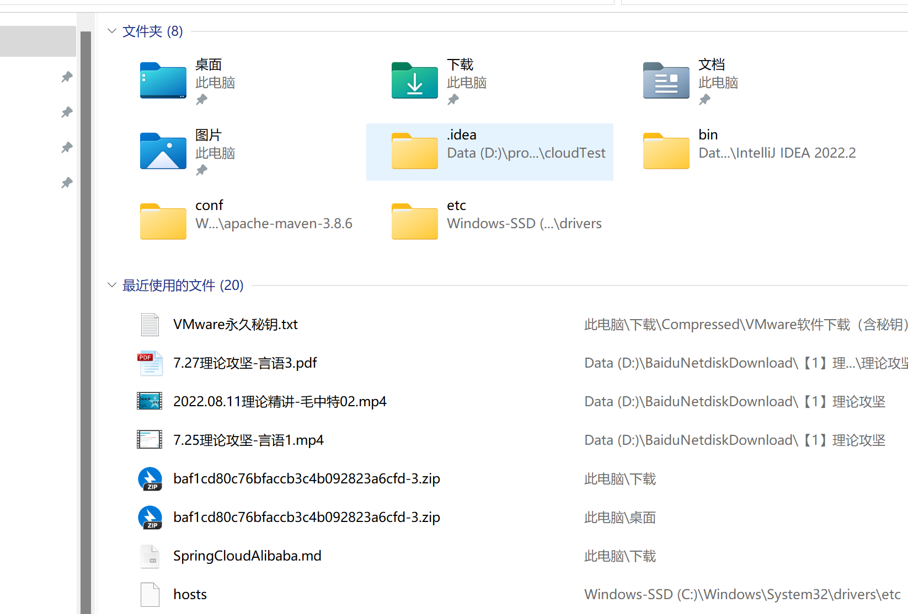

# SpringCloud

2022年8月30日
完成eureka的部分；
下面进行zookeeper的部分，结果，出现了配置问题。内存也是不太够用。打算换掉这个笔记本电脑。用旧的；
或者买一个新的32g的内存的轻薄笔记本。系统需要是win10.win11也是不太靠谱。
https://github.com/jiangxingyou/SpringCloud

2022年9月10日
> 现在完成了啥；完成了 gataway的部分；但是进度不好，不是很快。